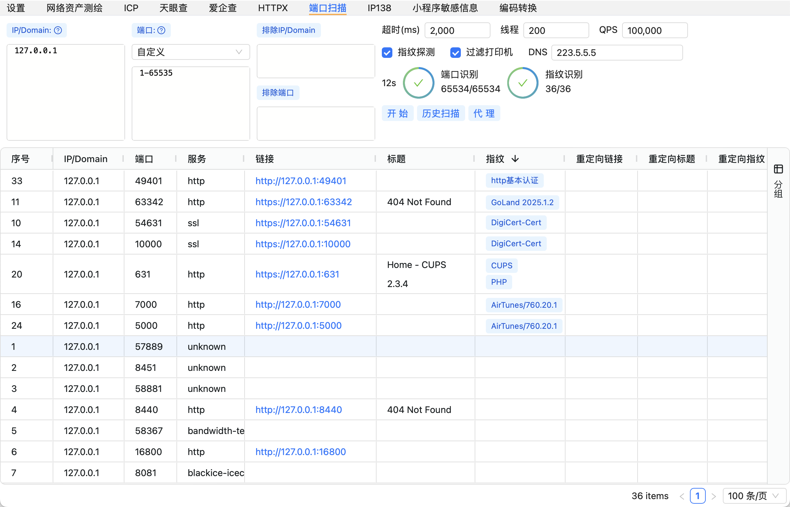

# 免责声明
1、本工具是在 “按现状” 和 “可用” 的基础上提供的，不提供任何形式的明示或暗示的保证，包括但不限于对适销性、特定用途适用性、准确性、完整性、无侵权以及非侵权性的保证。

2、在任何情况下，工具的开发者、贡献者或相关组织均不对因使用本工具而产生的任何直接、间接、偶然、特殊、典型或后果性的损害负责，这些损害包括但不限于数据丢失、业务中断、利润损失、声誉损害、系统故障、计算机病毒感染、网络攻击导致的损失或任何其他经济或非经济损失，即使开发者、贡献者或相关组织已被告知可能发生此类损害。

3、使用者理解并同意，使用本工具可能涉及访问和操作各种计算机系统和网络资源，使用者应自行承担因违反这些法律规定而产生的全部法律责任。开发者、贡献者或相关组织不承担因使用者违反法律规定而导致的任何法律后果或责任。

# Fine

# 使用说明
- macOS提示文件损坏请执行`sudo xattr -d com.apple.quarantine Fine.app`命令后重新打开
- 超时均采用纳秒
- 资产测绘API KEY自行在对应平台获取
- 天眼查AUTH-TOKEN为登陆后Cookie中的`auth_token`字段内容
- 爱企查Cookie需要Burp/Yakit等抓包获取
- ICP批量查询务必使用代理池，因代理问题批量任务终止可点击`继续`进行查询不用重新执行开始
- HTTPX不会使用全局代理，只会使用设置的代理
- 端口扫描依托于域名解析的IP，如果识别不到请更换DNS，线程根据本机资源设置，QPS根据目标资源大致设置
- windows小程序敏感信息提取`只支持微信v3`，`v4不支持`，路径选择为: `..../选择本级目录/wx...../12/__APP__.wxapkg`，具体位置自行查询

## TODO

？？？

# 关于开源
代码变动较大不太规范，后续稳定后考虑重新开源

# 交流群

