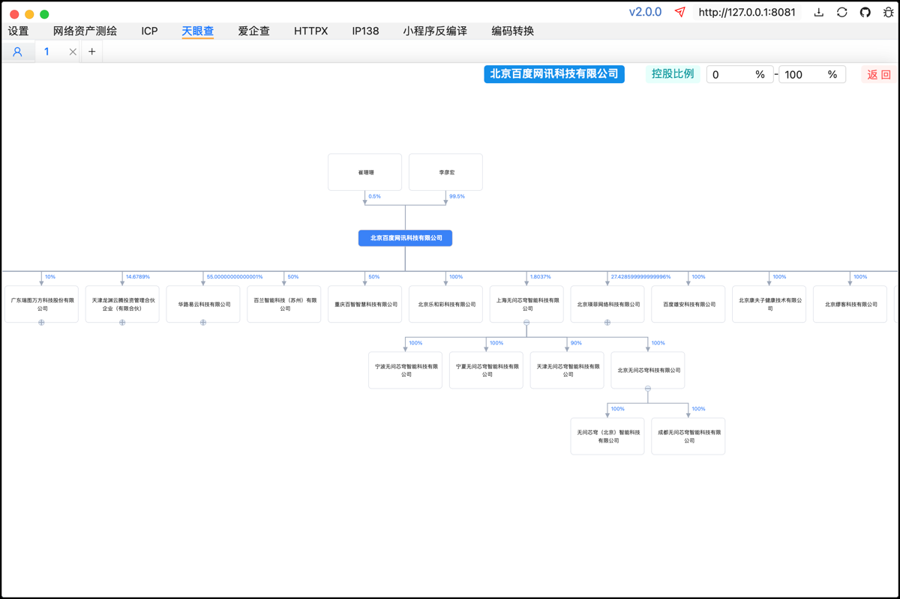
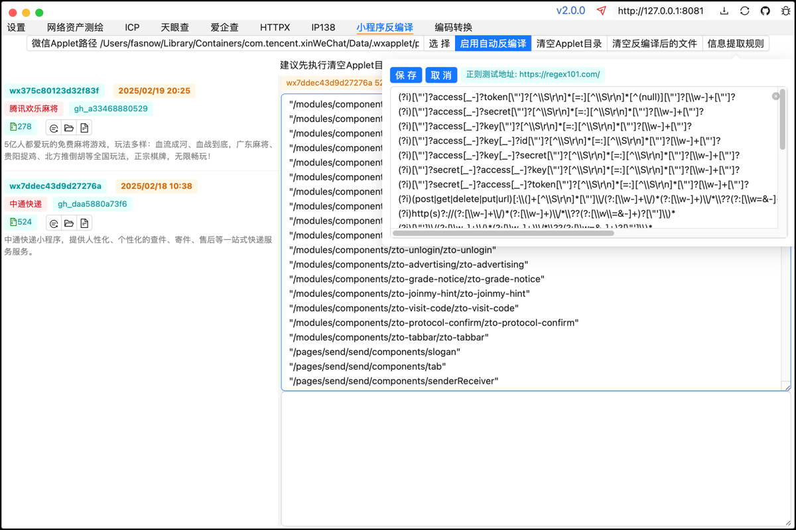

# 免责声明
1、本工具是在 “按现状” 和 “可用” 的基础上提供的，不提供任何形式的明示或暗示的保证，包括但不限于对适销性、特定用途适用性、准确性、完整性、无侵权以及非侵权性的保证。

2、在任何情况下，工具的开发者、贡献者或相关组织均不对因使用本工具而产生的任何直接、间接、偶然、特殊、典型或后果性的损害负责，这些损害包括但不限于数据丢失、业务中断、利润损失、声誉损害、系统故障、计算机病毒感染、网络攻击导致的损失或任何其他经济或非经济损失，即使开发者、贡献者或相关组织已被告知可能发生此类损害。

3、使用者理解并同意，使用本工具可能涉及访问和操作各种计算机系统和网络资源，这种访问和操作可能违反某些地区的法律、法规或政策，使用者应自行承担因违反这些法律规定而产生的全部法律责任。开发者、贡献者或相关组织不承担因使用者违反法律规定而导致的任何法律后果或责任。
# Fine

网络空间资产测绘、ICP备案、天眼查股权结构图、IP138域名解析与IP反查、外部HTTP调用与小程序反编译。

设置认证信息，天眼查为auth_token，爱企查为cookie。ICP批量查询务必使用代理池(如：https://github.com/thinkoaa/Deadpool)。




=======

macOS提示文件损坏请执行下面命令后重新打开。

```
sudo xattr -d com.apple.quarantine Fine.app
```
# 自主编译

不要在ide控制台执行下面命令，会出现奇怪的问题，建议在项目目录下打开terminal执行。

第一步：环境。

```
git https://git-scm.com/downloads
nodejs https://nodejs.org/en/download/prebuilt-installer （只支持18版本）
golang https://go.dev/dl/
wails https://wails.io/docs/gettingstarted/installation
```

第二步：初始化。

```
git clone https://github.com/fasnow/fine.git && cd fine && go mod tidy && cd frontend && npm install --force  
```

第三步：微信小程序反编译相关，重构了js代码，该可执行文件可单独使用。

```
cd fine/wechatMiniProgram && npm install --force && npm run build
windows 额外执行 cd ../backend/service/service/wechat && mv decompile.exe decompile
# 如果提示pkg不存在先执行npm install pkg --force后再执行上述命令
```


第四步：生成的可执行文件在`fine/build/bin`目录下。

```
cd fine && wails build
```

## TODO

？？？

