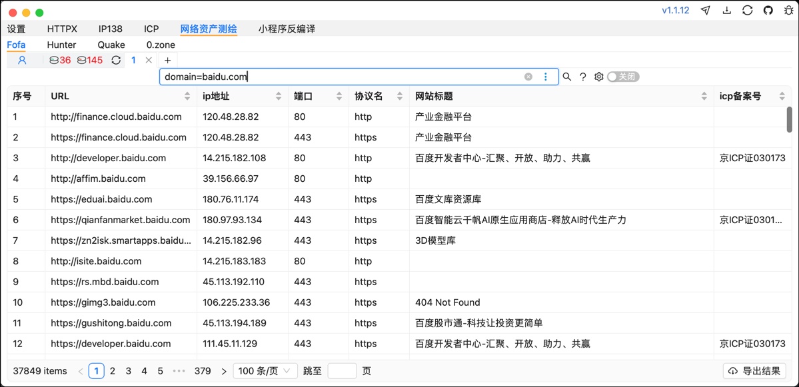
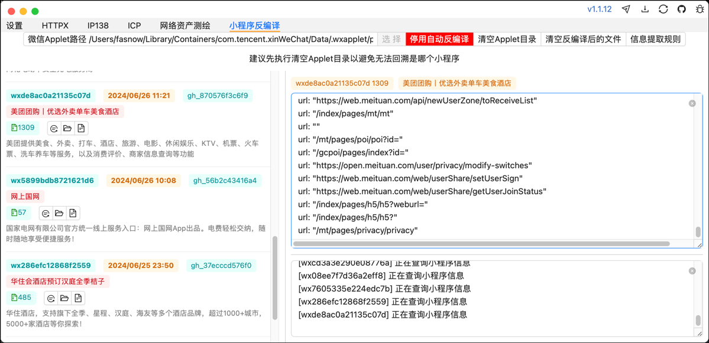
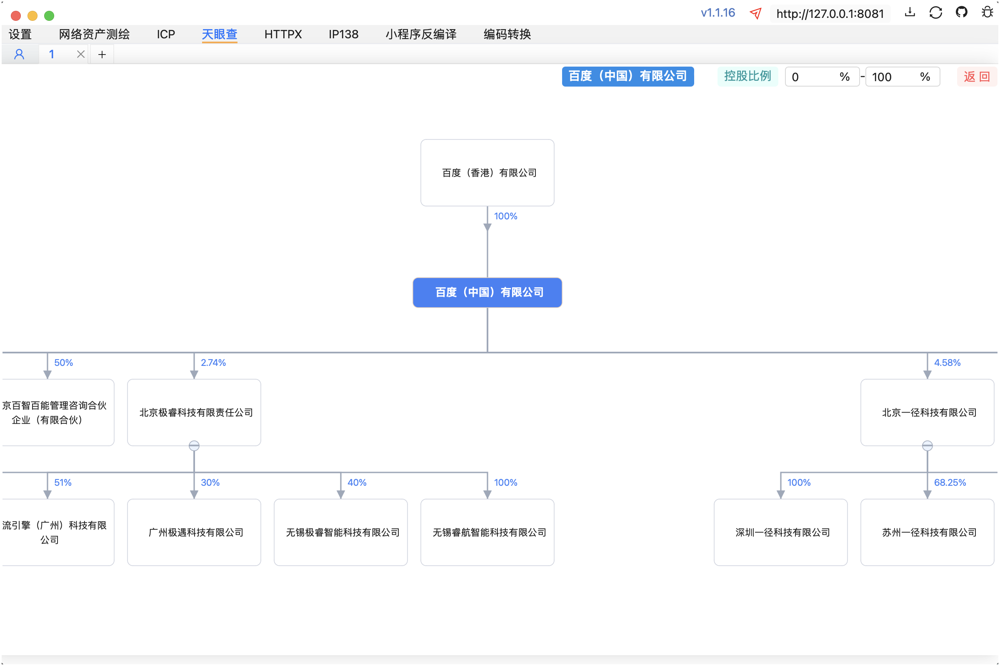

# Fine

网络空间资产测绘、ICP备案、天眼查股权结构图、IP138域名解析与IP反查、外部HTTP调用与小程序反编译。




=======

macOS提示文件损坏请执行下面命令后重新打开。

```
sudo xattr -d com.apple.quarantine Fine.app
```
# 自主编译

不要在ide控制台执行下面命令，会出现奇怪的问题，建议在项目目录下打开terminal执行。

第一步：环境。

```
git https://git-scm.com/downloads
nodejs https://nodejs.org/en/download/prebuilt-installer （只支持18版本）
golang https://go.dev/dl/
wails https://wails.io/docs/gettingstarted/installation
```

第二步：初始化。

```
git clone https://github.com/fasnow/fine.git && cd fine && go mod tidy && cd frontend && npm install --force  
```

第三步：微信小程序反编译相关，重构了js代码，该可执行文件可单独使用。

```
cd fine/wechatMiniProgram && npm install --force && npm run build
windows 额外执行 cd ../backend/service/service/wechat && mv decompile.exe decompile
# 如果提示pkg不存在先执行npm install pkg --force后再执行上述命令
```


第四步：生成的可执行文件在`fine/build/bin`目录下。

```
cd fine && wails build
```

## TODO

？？？

