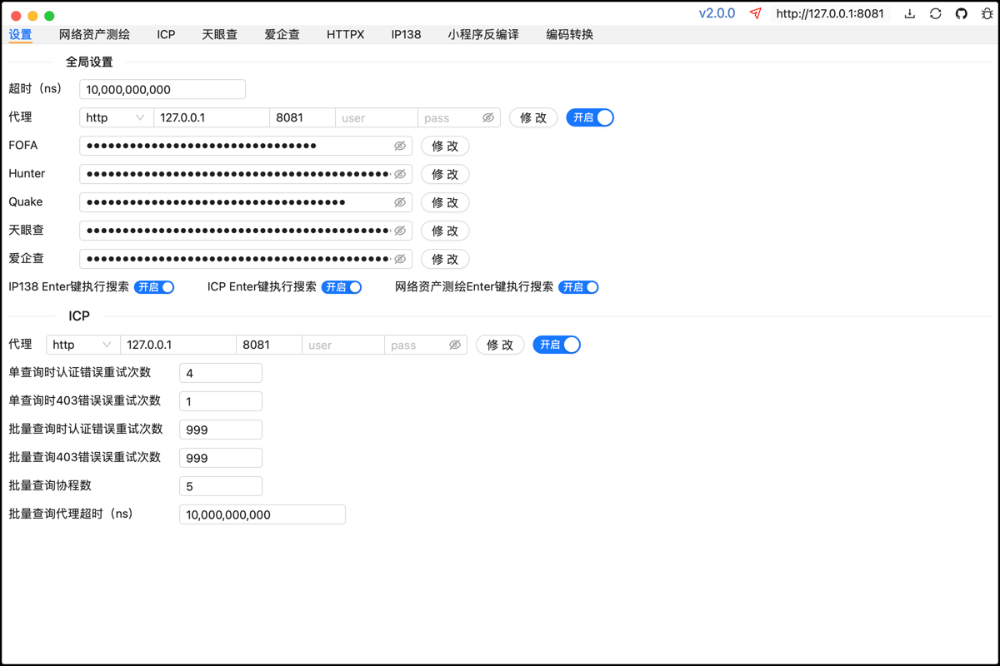
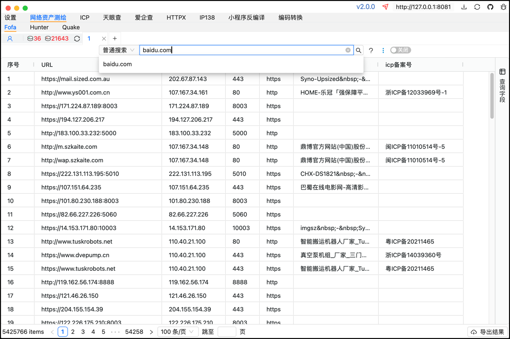
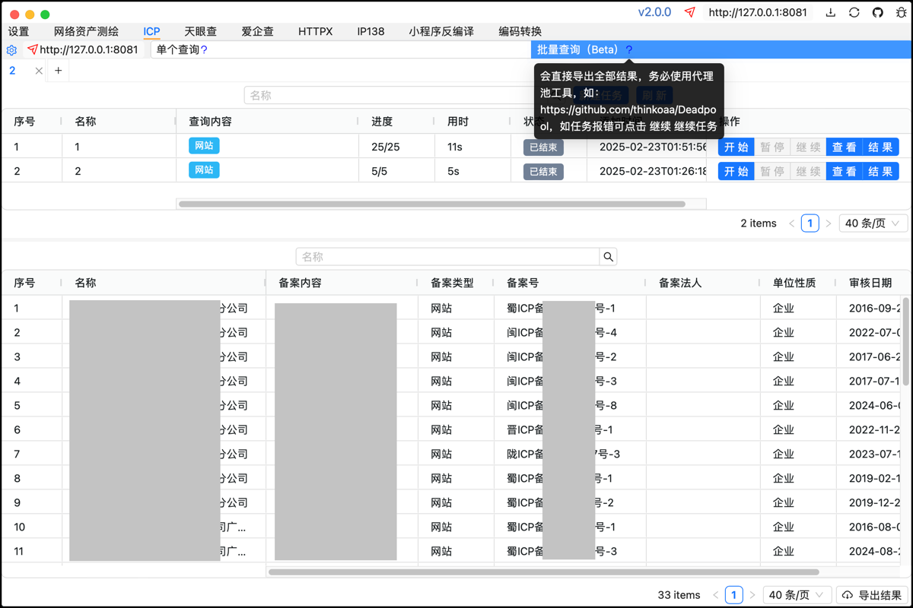

# 免责声明
1、本工具是在 “按现状” 和 “可用” 的基础上提供的，不提供任何形式的明示或暗示的保证，包括但不限于对适销性、特定用途适用性、准确性、完整性、无侵权以及非侵权性的保证。

2、在任何情况下，工具的开发者、贡献者或相关组织均不对因使用本工具而产生的任何直接、间接、偶然、特殊、典型或后果性的损害负责，这些损害包括但不限于数据丢失、业务中断、利润损失、声誉损害、系统故障、计算机病毒感染、网络攻击导致的损失或任何其他经济或非经济损失，即使开发者、贡献者或相关组织已被告知可能发生此类损害。

3、使用者理解并同意，使用本工具可能涉及访问和操作各种计算机系统和网络资源，这种访问和操作可能违反某些地区的法律、法规或政策，使用者应自行承担因违反这些法律规定而产生的全部法律责任。开发者、贡献者或相关组织不承担因使用者违反法律规定而导致的任何法律后果或责任。
# Fine

网络空间资产测绘、ICP备案、天眼查股权结构图、IP138域名解析与IP反查、外部HTTP调用与小程序反编译。

设置认证信息，天眼查为auth_token，爱企查为cookie。ICP批量查询务必使用代理池(如：https://github.com/thinkoaa/Deadpool )。






# 注意事项
- macOS提示文件损坏请执行`sudo xattr -d com.apple.quarantine Fine.app`命令后重新打开；
- windows小程序路径一般为`...\WeChat Files\Applet`，需选择包含目录结构如：`...\Applet\wx...\12\__APP__.wxapkg`，反编译仅提取了文件做敏感信息查找或者简单可阅读，微信开发者工具无法运行；
- httpx无法运行一般为权限问题；
- 数据表格默认均可单元格和多范围选中按键复制。

# 自主编译

第一步：环境。

```
git https://git-scm.com/downloads
golang https://go.dev/dl/
wails https://wails.io/docs/gettingstarted/installation
```

第二步：生成的可执行文件在`fine/build/bin`目录下。

```
git clone https://github.com/fasnow/fine.git && cd fine && wails build
```

## TODO

？？？

