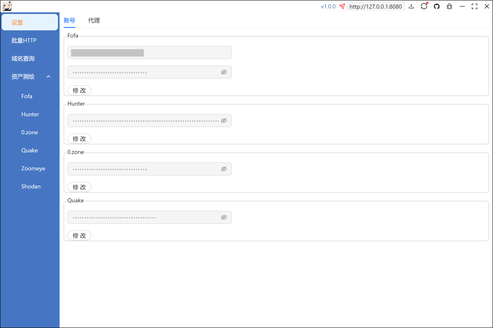
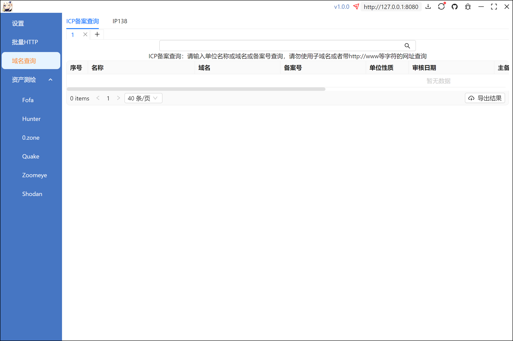
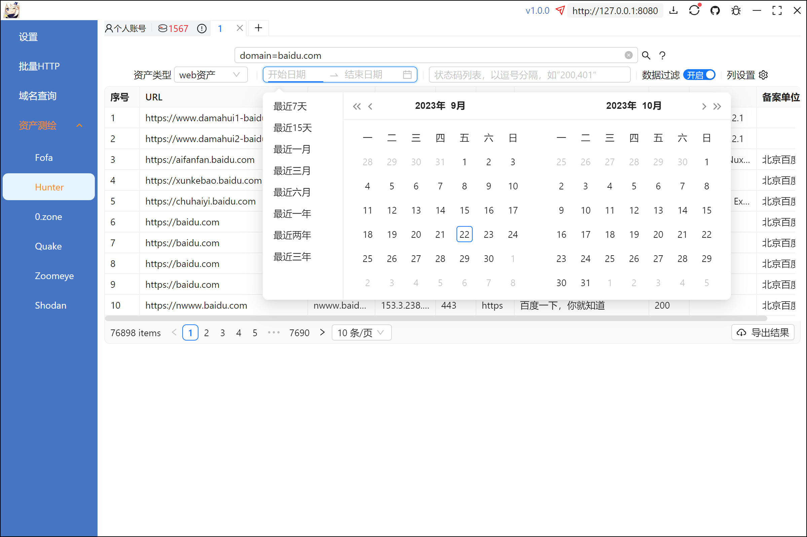
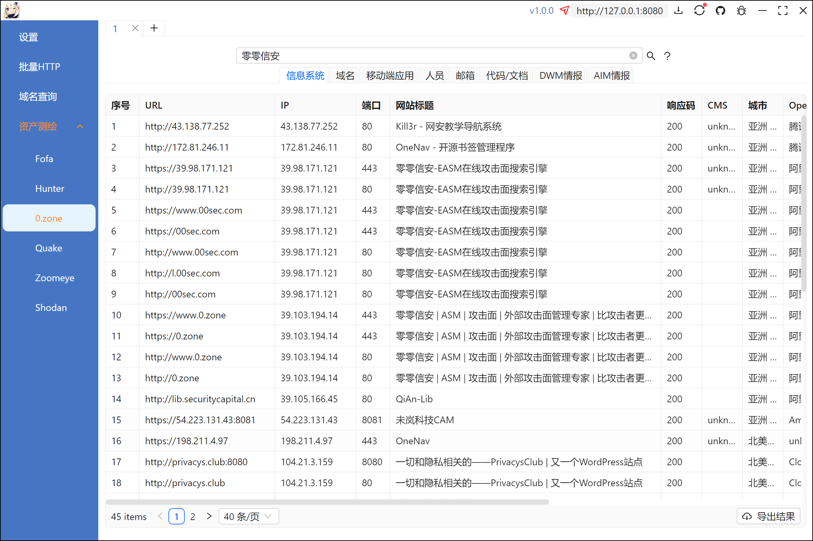
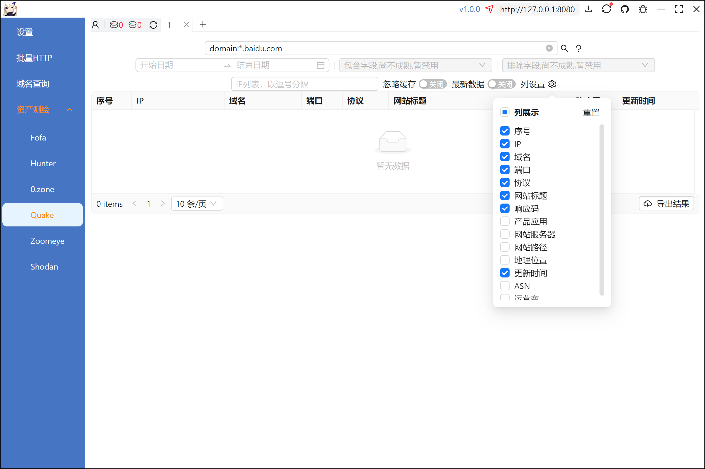
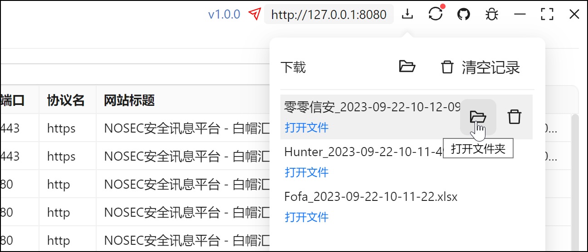

# fine

## 简介

网络空间资产测绘工具，目前支持fofa、hunter、quake和零零信安，以及一些其他功能。

工具使用electron+typescript<s>+vue3+element plus</s>+react+antd+golang构建。

## 更新内容
**2023.09.22 v1.0.0** 

1. 经过不专业的功能测试重构完成...；
2. 新增IP138历史域名和IP批量查询功能；
3. 优化了现有功能。

**2023.07.13 v0.0.15** 

1. 修复部分电脑无法导出查询结果的bug。

**2023.07.11 v0.0.14** 

1. 修复已知问题。

**2023.07.10 v0.0.13** 

1. 添加下载列表功能；
2. 优化导出文件功能；
3. 修复已知翻页问题;
4. 去除IP显示功能。

## 使用方法（20230922）

账号以及代理设置



域名查询



Fofa查询页面。***列展示为查询的返回字段，即列展示设置了哪些字段查询结果就会包含该字段，其余平台的列展示只是显示或者隐藏现有的数据***


Hunter查询页面。快速选中你想要的数据时间范围，最大支持近三年。



零零信安查询页面



Quake查询页面



数据历史下载列表。下载完毕后自动弹出历史记录，数据默认存放在当前目录的```data```文件夹下，暂无法自定义。



里面有一个隐藏小彩蛋^_^

## **交流群**


## TODO

？？？

