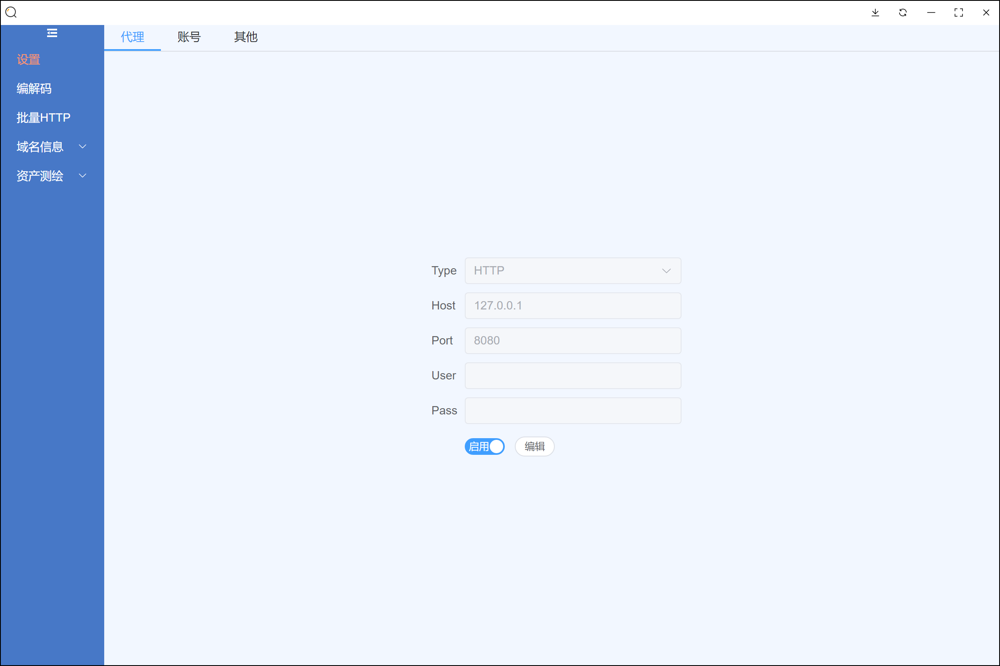
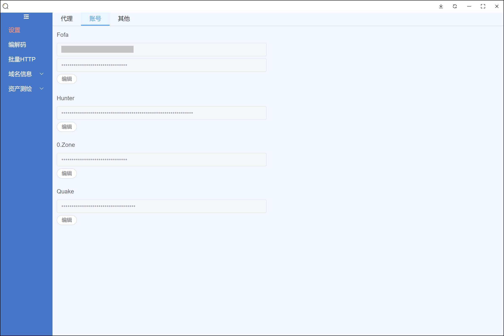
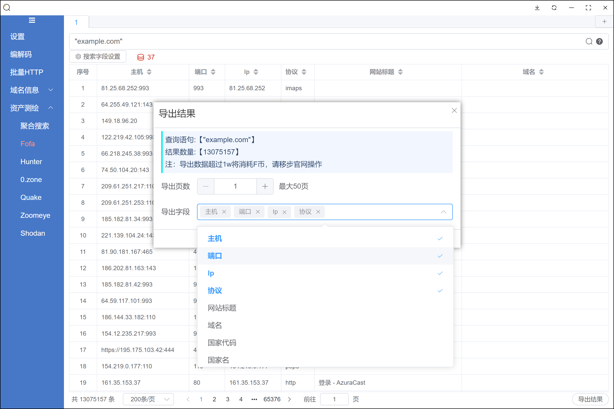
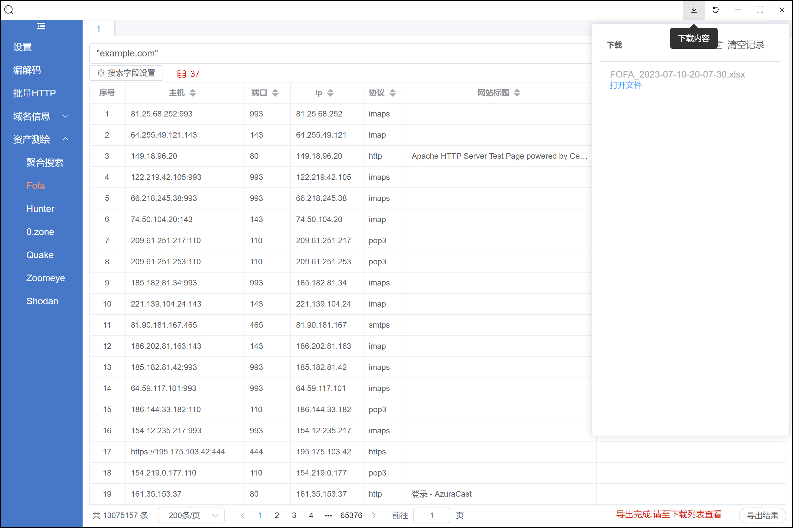
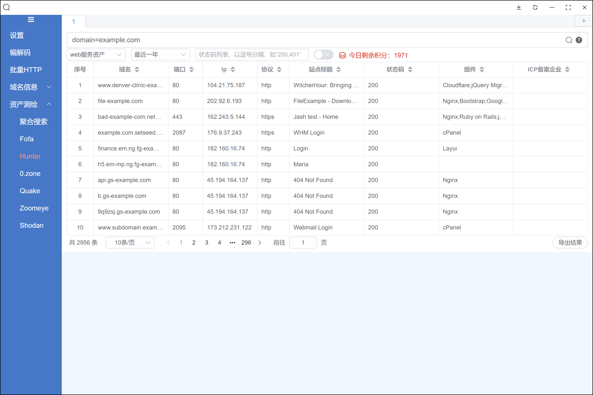
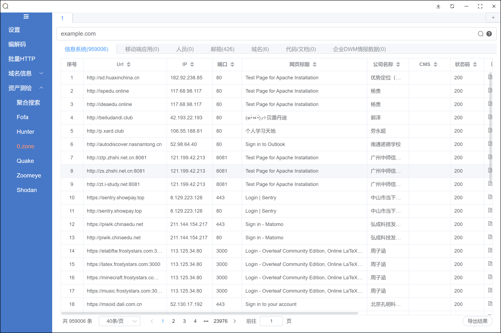
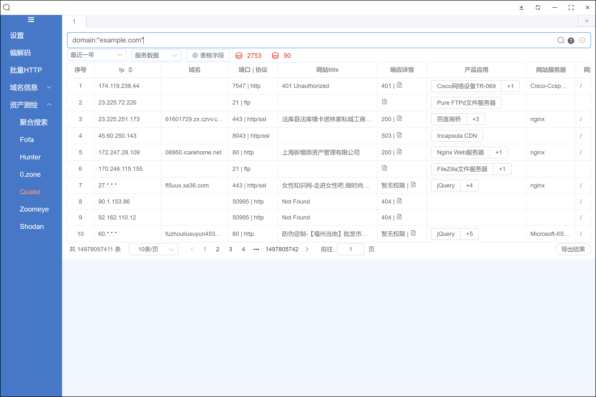
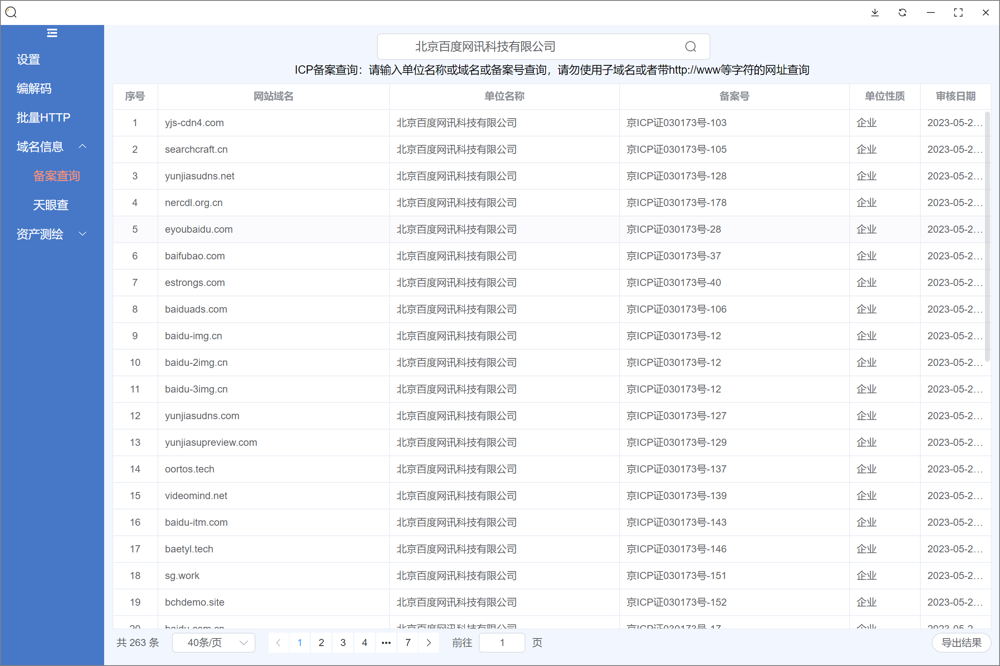

**2023.08.21 改版中，从vue换到react...**

**2023.09.11 之前的版本已删除，需要新版内测版可以邮箱获取【ifasnow@163.com】**

# fine

## 简介

网络空间资产测绘工具，目前支持fofa、hunter、quake和零零信安，以及一些其他功能。

## 更新内容
**2023.07.13 v0.0.15** 

1. 修复部分电脑无法导出查询结果的bug。

**2023.07.11 v0.0.14** 

1. 修复已知问题。

**2023.07.10 v0.0.13** 

1. 添加下载列表功能；
2. 优化导出文件功能；
3. 修复已知翻页问题;
4. 去除IP显示功能。

## 使用方法

Base64按行编码解码。

备案查询。

## TODO

？？？

