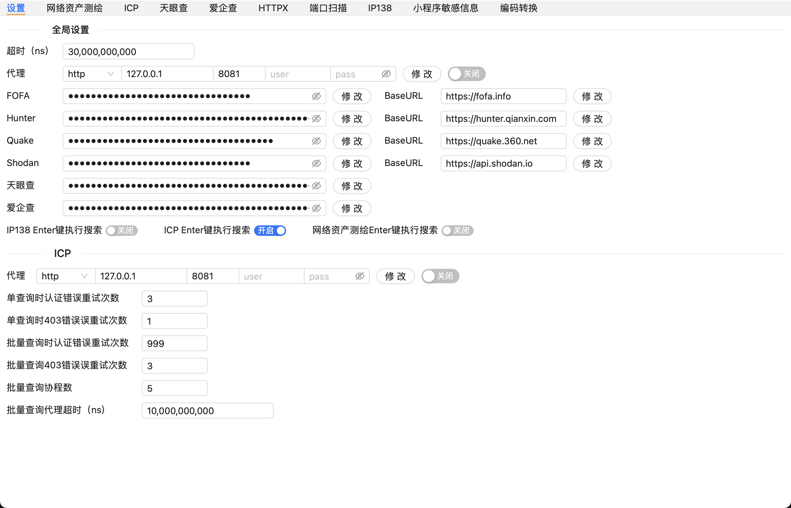
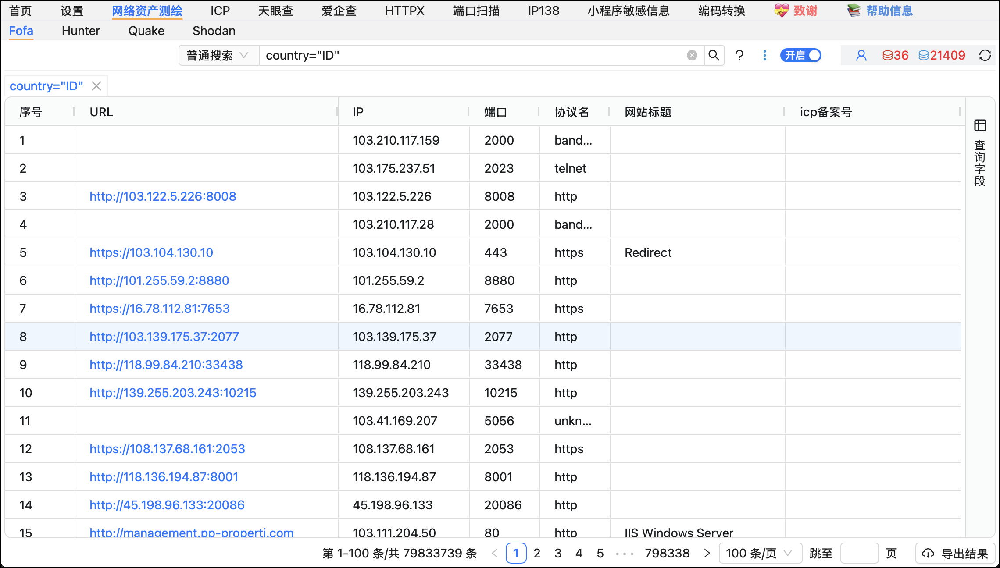
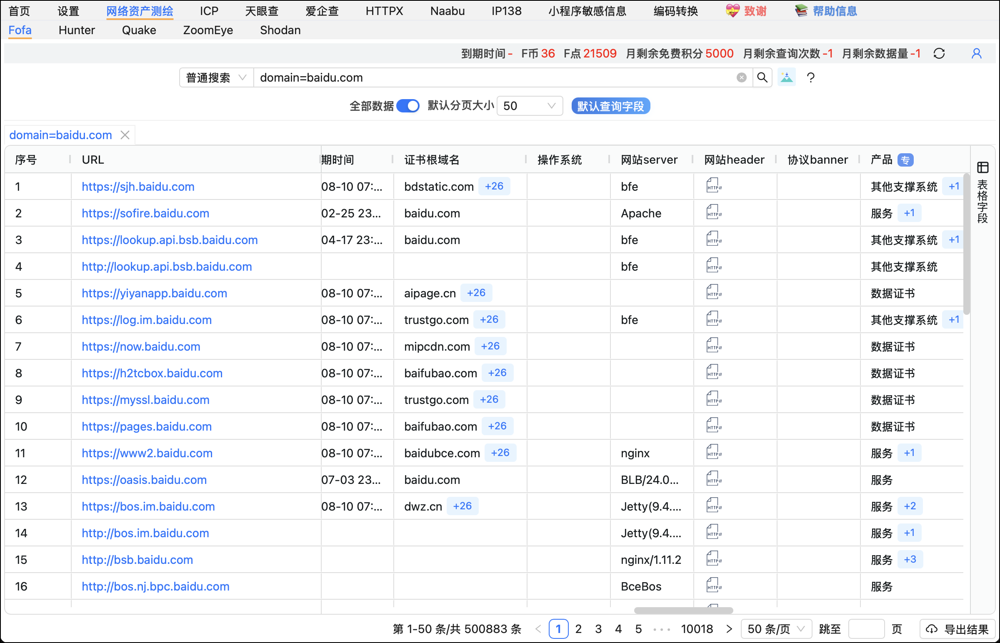
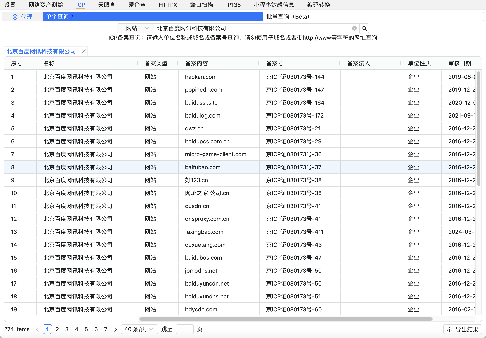
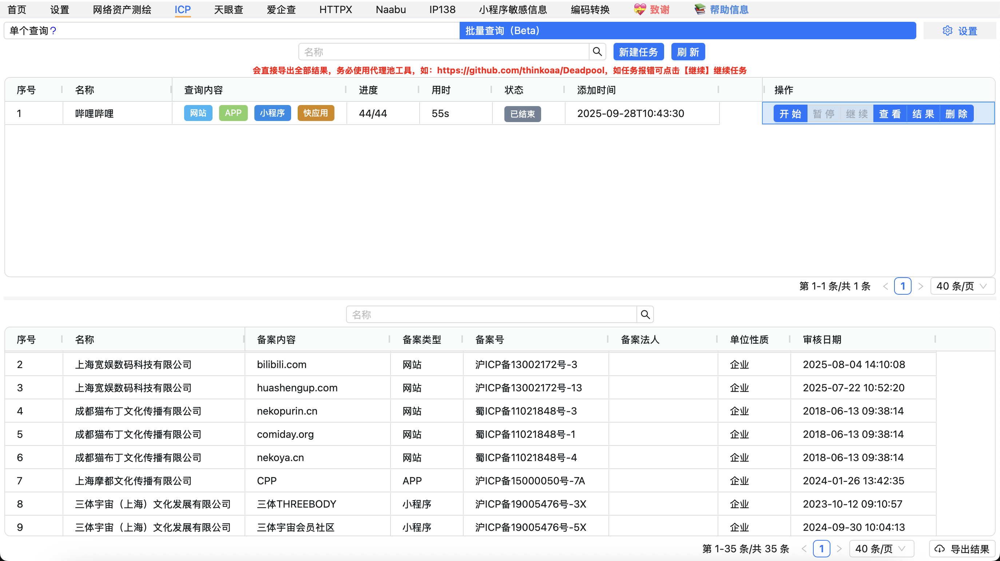
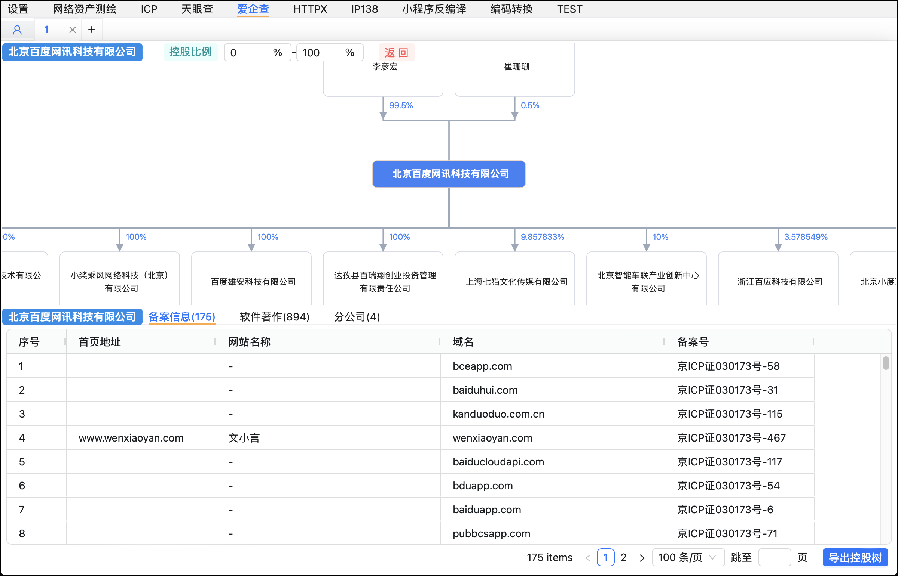
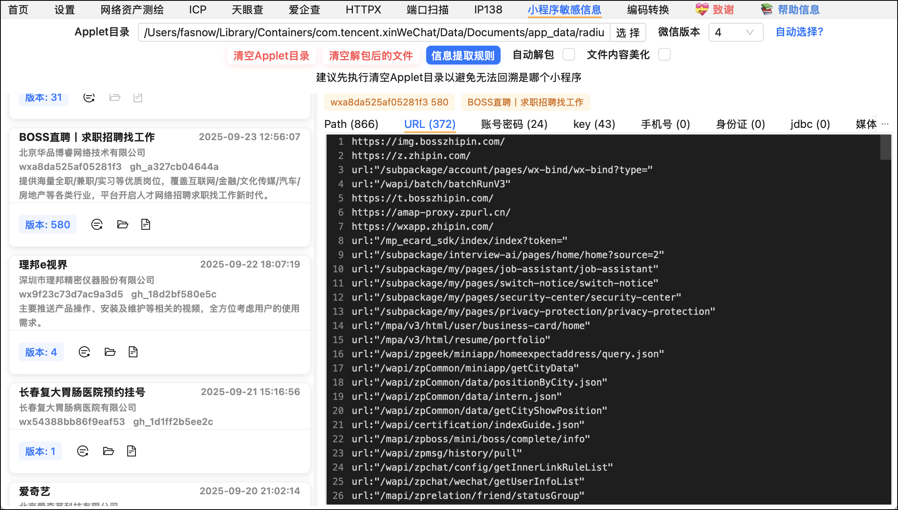

# 🛡️ 免责声明

> **⚠️ 注意：使用本工具请务必仔细阅读以下免责声明！**

1. 本工具以“按现状”与“可用”原则提供，不作任何明示或暗示的担保，包括但不限于适销性、特定用途适用性、准确性、完整性、无侵权承诺等。
2. 在任何情况下，工具的开发者、贡献者或相关组织均不对因使用本工具而产生的任何直接、间接、偶然、特殊或后果性损失负责（如数据丢失、业务中断、利润损失、声誉受损、系统故障、计算机病毒、网络攻击等），即使已被告知可能发生此类损害。
3. 使用者须了解并同意，因使用本工具而涉及访问/操作各种计算机系统和网络资源，需自担遵守相关法律法规的全部责任。若因违规产生任何法律后果，开发者、贡献者及相关组织概不负责。

---

# 🎉 Fine - 订阅/权益说明

- **订阅说明：**  
  2.5.12及后续版本无订阅

---

**作者微信号：`fasnowww`**

---

# 👥 朋友的 [圈子](https://pc.fenchuan8.com/#/index?forum=106741&yqm=11GB)

1. 安艺圈内部知识库，包含dddd专项漏洞及漏洞实战案例工具等，如Nextjs RCE实战记录等；
2. SRC和HVV相关内容（分享SRC和HVV实战案例、burp插件规则和实战密码字典等内容）；
3. dddd原版bug和指纹POC持续优化，leak-info-finder接口自动化爬取加自动敏感数据识别工具；
4. JAVA代码审计从0到1学习记录，包括学习工具和个人实战案例等。

---

# 🚀 功能模块预览

> **⚠️ macOS 温馨提示：**  
> 若遇文件损坏请执行  
> `sudo xattr -d com.apple.quarantine Fine.app`  
> 后重新打开

---

# ⭐ Star Chart

  

---

# ✨ 其他说明

---

### 1️⃣  **资产测绘模块**

- **Host 可自定义**（不能以`/`结尾，确保所有查询、用户信息接口与官网一致）
- **FOFA**：按API等级配置字段，超权限接口有错误提示  
- **Hunter**：全部字段可选，无等级限制，限制境外IP  
- **Quake**：全部字段可选，仅返回当前等级数据，非会员请勿勾选全部数据
- **ZoomEye**：全部字段可选，仅返回当前等级数据，注册积分不可用于API  
- **Shodan**：暂无特殊说明

---

### 2️⃣ **ICP模块相关**

- 📝 **OCR脚本使用提醒：**  
  - ⚠️ 不熟悉IDE配置建议勿IDE运行OCR脚本  
- ⏩ **批量查询&代理池建议：**  
  - 🚩 推荐高质量代理池（勿用免费代理，影响体验），优先选临时代理池  
  - 💡 常见IP切换：  
    - 每秒切换  
    - 每分钟切换  
    - 每次请求切换 **（推荐，适合任务量大场景）**  
  - ⏱️ 不同代理池有速率限制，详情见供应商说明，同时需设置“并发量”和“单位时间（ns）”以适配策略  
  - 🔄 自带重试，重试次数不宜过高，异常高应中止，支持断点续查

---

### 3️⃣ **企业信息查询**

- **爱企查**：半自动认证检测绕过不优，后续将改为手动绕过，推荐使用代理池降低人机检测，限制境外IP

---

### 4️⃣ **小程序敏感信息模块**

- 📁 目录“帮我选择”可快捷配置
- ⏳ 查询不到信息多因三方接口偶发，5分钟自动重试，欢迎投稿更优方案
- 🧵 默认线程数为 2 x CPU核数，一般无需改动
- 限制：为非完整结构反编译，不可导入微信开发者工具。如需完整结构推荐 [KillWxapkg](https://github.com/Ackites/KillWxapkg)

---